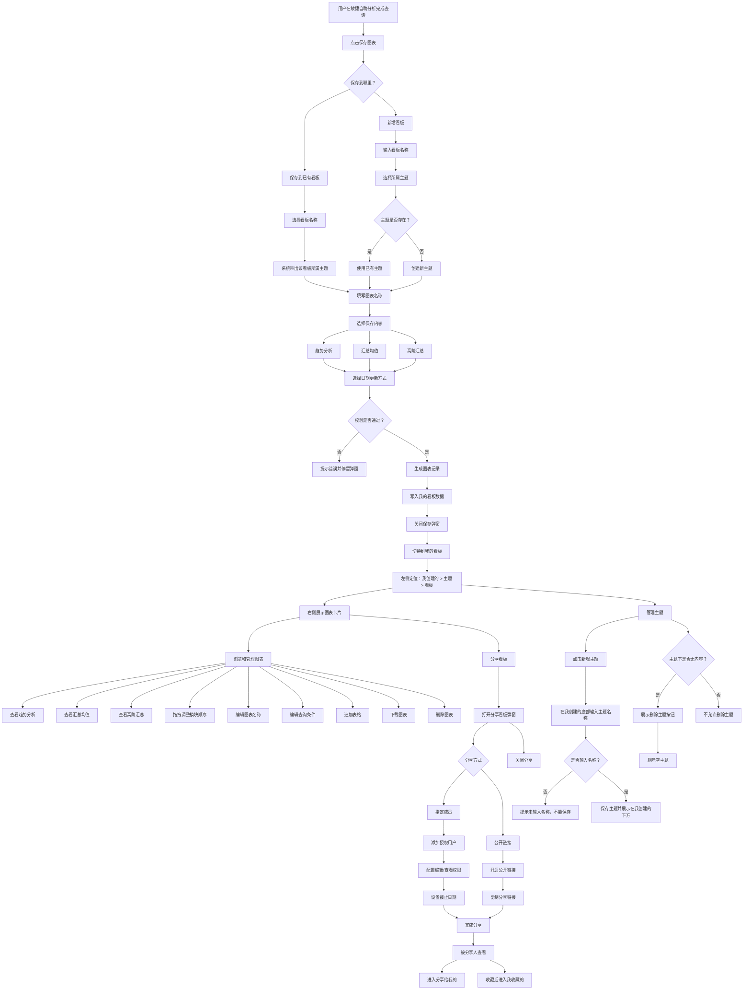

# 保存图表及我的看板产品流程图

## 流程说明

该流程覆盖用户从「敏捷自助分析」保存图表，到进入「我的看板」查看、管理主题、管理图表、分享看板的完整路径。

## 产品流程图

## 飞书使用方式

1. 在飞书文档中插入 Mermaid 图或代码块。
2. 将上方 `mermaid` 代码块内容粘贴进去。
3. 如飞书当前文档环境不支持 Mermaid，可将该流程图转成图片后插入文档。
