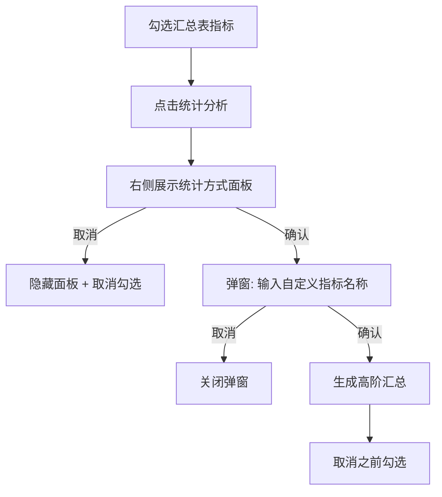

# 敏捷BI统计分析与趋势明细原型 PRD（评审版）

- 文档版本：V1.0  
- 产出日期：2026-04-11  
- 产出人：OpenClaw Assistant  
- 基于原型：`D:/skilltohtml/0408-skilltohtml-prototype-iceblue-v9.html`

---

## 一、概述（为什么做）

### 1.1 背景与目标
当前“敏捷自主分析”页面已具备维度筛选、指标筛选、趋势图、汇总表能力，但统计分析流程与趋势明细交互仍在快速迭代。需要形成一份可评审 PRD，统一前端、产品、测试对以下能力的认知：

1. 统计分析（数值型/比率型）分流逻辑  
2. 统计方式右侧面板与命名弹窗的协同流程  
3. 趋势明细表格与“指标/日期倒置”交互  
4. 数据管理模块基础信息架构与入口能力

### 1.2 产品目标
- **业务目标**：提高经营分析自助效率，减少二次导出加工。  
- **用户目标**：分析师可在单页完成筛选→查询→统计汇总→趋势明细查看。  
- **体验目标**：统计分析操作链路可理解、可撤销、可复用。

### 1.3 目标用户
- 经营分析师
- 区域管理者
- 数据BP

### 1.4 角色与权限（当前原型）
- 原型未区分角色权限（统一可见）【待确认】

---

## 二、产品范围与页面结构（做什么）

### 2.1 模块范围
1. 敏捷自主分析（重点）
2. 数据管理（指标列表/修饰词列表/维度字典/模型管理）
3. 经营周报（占位）
4. 经营分析（占位）

### 2.2 主页面信息架构
- 顶部模块导航：敏捷自主分析 / 经营周报 / 经营分析 / 数据管理
- 筛选区：日期粒度、当前期/对比期、构成维度
- 双面板：维度选择区 + 指标选择区
- 已选指标条：查询/清空
- 趋势分析区：折线图、柱状图、趋势明细表格
- 汇总区：汇总均值 + 高阶汇总

### 2.3 页面截图
> 说明：截图来源于原型本地运行页面。

---

## 三、功能需求（怎么做）

## 3.1 功能点清单（功能点 + 描述）

| 功能点 | 功能点描述 |
|---|---|
| 模块切换 | 支持在敏捷自主分析/经营周报/经营分析/数据管理间切换 |
| 日期筛选 | 支持按日/周/月/季/年切换，支持当前期与对比期 |
| 维度选择 | 支持地区、大区经理、城市、门店、会员等级、消费时段、菜品等筛选 |
| 指标选择 | 支持经营/财务/会员指标选择与联动 |
| 查询执行 | 将筛选条件作用于趋势区与汇总区 |
| 汇总均值表 | 展示本期/同期/差值/变动幅度（SUM + AVG） |
| 统计分析面板 | 点击“统计分析”后在右侧展示统计方式（不立即弹窗） |
| 数值型统计分析 | 展示计算方式：总值=Σ汇总值、均值=AVG均值；支持确认/取消 |
| 比率型统计分析 | 展示统计方式、分母处理方式（分母不累加/分母累加）、计算公式 |
| 命名弹窗 | 仅输入“自定义指标名称”，确认后生成高阶汇总 |
| 取消逻辑 | 取消统计分析时隐藏面板并取消当前指标勾选 |
| 高阶汇总生成 | 按配置生成高阶汇总记录并展示于下方表格 |
| 趋势图样式切换 | 折线图/柱状图/趋势明细表格切换 |
| 趋势明细倒置 | 在趋势明细模式显示“指标/日期倒置”按钮 |
| 明细分页 | 日期作为首列时最多显示15行，超出分页 |
| 数据管理-指标列表 | 指标查询、查看、复制新增、编辑、删除 |
| 数据管理-修饰词列表 | 修饰词筛选、详情、编辑、删除 |
| 数据管理-维度字典 | 维度筛选、详情、编辑、删除 |
| 数据管理-模型管理 | 模型筛选、查看、编辑、删除 |

---

## 3.2 关键流程描述

### 3.2.1 统计分析（统一流程）

### 3.2.2 数值型指标规则
- 进入统计分析：不弹窗，右侧展示统计方式。  
- 计算方式固定：`总值 = Σ(各指标汇总值结果)、均值 = AVG(各指标均值结果)`。  
- 点取消：隐藏右侧配置并取消勾选。  
- 点确认：进入“仅名称输入”弹窗。

### 3.2.3 比率型指标规则
- 进入统计分析：不弹窗，右侧展示统计方式。  
- 展示项：统计方式、分母处理方式（分母不累加/分母累加）、计算公式。  
- 若统计方式=按结果值直接累加：隐藏分母处理方式。  
- 点取消：隐藏右侧配置并取消勾选。  
- 点确认：进入“仅名称输入”弹窗。

### 3.2.4 统计面板联动规则
- 在未确认前，若用户更换勾选指标，右侧统计方式须实时联动刷新。  
- 当无任何勾选时，面板自动隐藏。

### 3.2.5 趋势明细倒置与分页
- 仅当趋势样式=趋势明细表格时，显示“指标/日期倒置”按钮。  
- 倒置后：
  - 首列：日期（或“当前期 VS 对比期”）
  - 首行分组：指标名称
- 首列为日期时，单页最多15行，超出显示上一页/下一页分页控件。

---

## 3.3 交互与UI规范（当前迭代）

### 3.3.1 统计分析面板按钮规范
- 位置：统计方式面板内，左对齐。  
- 按钮尺寸：宽 36px，高 24px。  
- 按钮文案：取消 / 确认。  
- 按钮用途：仅作用于当前面板配置。

### 3.3.2 面板布局规范
- 维度选择区与指标选择区间距：2px。  
- 左侧维度区左边框位置不变、右侧指标区右边框位置不变。  
- 中间冗余空间回收给两区内容。

---

## 四、非功能需求

### 4.1 可用性
- 面板/弹窗取消行为必须可预期，不得残留脏状态。

### 4.2 性能
- 趋势明细表格切换与倒置操作建议响应 < 300ms【待确认】。

### 4.3 稳定性
- 分页状态与倒置状态切换时不得出现表头错位。

### 4.4 埋点建议
- 事件：`bi_stat_apply_click`（统计分析点击）
- 事件：`bi_stat_inline_confirm/cancel`
- 事件：`bi_trend_table_swap_axis`
- 事件：`bi_trend_table_page_change`
- 属性：指标类型、统计方式、分母处理方式、是否对比期、页码

---

## 五、验收标准

### 5.1 统计分析验收
1. 数值型指标进入统计分析后，右侧显示固定计算方式，不弹窗。  
2. 比率型指标进入统计分析后，显示统计方式+分母处理方式+公式。  
3. 比率型“按结果值直接累加”时，分母处理方式隐藏。  
4. 面板取消后：面板消失、当前勾选取消。  
5. 面板确认后：弹窗仅输入自定义指标名称。  
6. 弹窗确认后：新增高阶汇总且原勾选取消。  
7. 未确认前切换指标，统计方式联动刷新。

### 5.2 趋势明细验收
1. 趋势样式切换到“趋势明细表格”时出现“指标/日期倒置”按钮。  
2. 倒置后首列为日期，首行按指标分组。  
3. 日期首列模式最多展示15行，超过15行可分页。  
4. 分页切换时表头/数据对齐正确。

### 5.3 布局验收
1. 维度区与指标区间距为2px。  
2. 两侧边框定位不漂移。

---

## 六、待确认项清单

### 必须确认
1. 当前页面是否需要角色权限控制（查看/编辑/删除分级）。
2. 高阶汇总命名是否允许重名。
3. 比率型“按结果值直接累加”是否需要风险提示文案。

### 建议确认
1. 趋势倒置后是否支持导出当前页/全量。  
2. 分页大小是否固定15或可配置。  
3. 数据管理各列表操作是否需要二次确认弹窗规范统一。

---

## 七、版本记录

| 版本 | 日期 | 变更说明 | 变更人 |
|---|---|---|---|
| V1.0 | 2026-04-11 | 基于原型梳理完整PRD结构、功能点、流程与验收标准 | OpenClaw Assistant |
