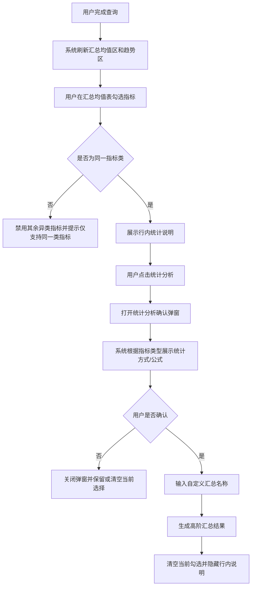

# 统计分析功能需求文档（评审版）

- 文档版本：V2.0
- 产出日期：2026-04-17
- 适用原型：`D:\skilltohtml\0408-skilltohtml-prototype-iceblue-v9.html`
- 文档目的：基于 v9 原型真实实现，整理统计分析相关功能逻辑，作为产品、研发、测试评审输入

---

## 1. 文档说明

### 1.1 范围
本文仅覆盖“敏捷自助分析”模块中的统计分析相关能力，不展开数据管理、经营分析、经营周报等非本次评审重点模块。

本次纳入评审的能力包括：

1. 汇总均值表
2. 统计分析入口与选择约束
3. 数值型/比率型指标的统计分析分流逻辑
4. 高阶汇总（派生结果）生成逻辑
5. 趋势分析图表与趋势明细表联动逻辑
6. 趋势明细表“指标/日期倒置”与分页逻辑
7. 构成分析开关对趋势展示的影响

### 1.2 文档原则

1. 以 v9 原型代码实际行为为准，不以历史口头方案为准。
2. 对原型中已经实现但存在歧义或前后链路不一致的部分，在“待确认项”中单独标出。
3. 本文中的“需求”分为两类：
   - 现状需求：原型已明确表达的逻辑，评审后可直接落地
   - 待确认需求：原型中有表现但口径仍需业务确认的逻辑

---

## 2. 业务背景与目标

### 2.1 背景
分析人员在同一分析页面中，除了需要查看单指标趋势外，还需要将多个同类指标进行汇总统计，快速生成一个新的分析结果，并继续在趋势区和结果区进行查看。当前 v9 原型已经具备统计分析的主要交互骨架，但其规则分散在汇总表、弹窗、趋势图和明细表中，缺少统一需求说明，不利于评审和后续开发落地。

### 2.2 目标

1. 支持用户在汇总均值表中勾选多个可组合指标，发起统计分析。
2. 根据指标类型自动匹配正确的统计方式与计算公式。
3. 生成可命名的高阶汇总结果，沉淀在结果区继续查看。
4. 支持在趋势分析区以图表或明细表形式查看查询结果。
5. 在趋势明细模式下支持“指标/日期倒置”，便于从不同维度阅读数据。
6. 保证统计分析过程中选择限制、提示、取消、确认、清空等状态可预期。

### 2.3 目标用户

1. 经营分析师
2. 区域经营/门店运营人员
3. 数据 BP / BI 使用人员

---

## 3. 页面与模块结构

统计分析功能位于“敏捷自助分析”模块中，依赖以下页面区域：

1. 查询条件区
   - 日期粒度
   - 当前期/对比期
   - 构成分析开关
   - 维度筛选
   - 指标选择
2. 趋势分析区
   - 图表样式：折线图 / 柱状图 / 趋势明细表格
   - 数据视角：只看数值 / 只看占比 / 全部
   - 指标/日期倒置
   - 双轴配置（特定场景显示）
3. 汇总均值区
   - 汇总指标表
   - 统计分析按钮
   - 行内统计说明面板
4. 高阶汇总区
   - 展示统计分析生成的新结果

---

## 4. 核心概念定义

### 4.1 指标类型

1. 数值型指标
   - 指标名称中不包含“率”
   - 例如：营业收入、外送收入、消费会员数、就餐人数
2. 比率型指标
   - 指标名称中包含“率”或占比类后缀
   - 例如：翻台率、占比

### 4.2 数据结果区定义

1. 汇总均值区
   - 用于展示当前查询结果的汇总值和均值
   - 支持勾选行，发起统计分析
2. 高阶汇总区
   - 用于展示统计分析后新生成的派生结果
   - 当前原型支持持续追加，不覆盖已有结果

### 4.3 构成分析

1. 构成分析 = 否
   - 趋势区默认以已选指标为主进行展示
   - 不展示柱状图入口
   - 数据视角固定为数值
2. 构成分析 = 是
   - 可按选中的构成维度查看多个系列
   - 可切换柱状图
   - 可切换只看数值 / 只看占比 / 全部

---

## 5. 功能范围

### 5.1 本次必须覆盖

1. 汇总均值表渲染
2. 统计分析指标选择限制
3. 统计分析行内说明
4. 统计分析确认弹窗
5. 高阶汇总结果生成
6. 趋势图/表切换
7. 趋势明细表倒置
8. 趋势明细表分页

### 5.2 本次不展开

1. 数据管理模块 CRUD 细节
2. 真实后端取数接口
3. 导出能力
4. 权限体系
5. 指标公式编辑器

---

## 6. 统计分析主流程

---

## 7. 功能需求明细

## 7.1 查询后结果刷新

### 7.1.1 触发条件

1. 用户执行查询
2. 用户切换日期、对比期、构成分析、维度、指标等查询条件

### 7.1.2 系统行为

1. 显示趋势分析区
2. 显示汇总均值区
3. 刷新汇总均值表数据
4. 刷新趋势图
5. 刷新趋势明细表

### 7.1.3 当前原型约束

1. 汇总均值区最多展示前 12 行结果
2. 趋势明细表的数据行由当前查询条件动态推导

---

## 7.2 汇总均值表

### 7.2.1 展示字段

汇总均值表展示两组指标结果：

1. 时间段内汇总值（SUM）
   - 本期
   - 去年同期/对比期
   - 对比差值
   - 变动幅度
2. 时间段内均值（AVG）
   - 本期
   - 去年同期/对比期
   - 对比差值
   - 变动幅度

### 7.2.2 单位展示规则

1. 桌数类指标显示“桌”
2. 人数类指标显示“人”
3. 翻台率类指标显示数值，不追加单位
4. 收入类指标显示金额单位
5. 比率型指标在均值列默认隐藏，显示为“-”

### 7.2.3 排序规则

1. 默认按本期汇总值倒序
2. 名称中包含下划线的明细结果优先于不包含下划线的汇总结果展示

---

## 7.3 统计分析选择规则

### 7.3.1 勾选规则

1. 仅允许勾选“同一指标类”的数据行进行统计分析。
2. 同一指标类的判断方式为：取数据名称最后一个下划线后的指标名作为 `metricKey`。
3. 当用户勾选第一项后：
   - 同类指标保持可选
   - 异类指标置灰并禁用
   - 异类指标 hover 文案提示“仅支持选择同一指标进行统计分析”

### 7.3.2 按钮规则

1. 勾选为空时，点击“统计分析”提示“请选择同一类指标进行统计分析”
2. 若因异常状态导致跨类勾选，点击“统计分析”仍需再次拦截

### 7.3.3 行内说明面板

当用户勾选指标后，汇总均值区顶部展示行内统计说明面板：

1. 数值型指标
   - 展示固定统计方式：直接累加
   - 展示固定公式：总值 = 各指标汇总值结果求和；均值 = 各指标均值结果求平均
2. 比率型指标
   - 展示统计方式单选
   - 支持“按比率重算（推荐）”
   - 支持“按结果值直接累加”
   - 若选择“按比率重算”，继续展示分母处理方式
   - 若选择“按结果值直接累加”，隐藏分母处理方式
3. 操作按钮
   - 取消：隐藏行内说明并取消当前勾选
   - 确认：进入仅输入名称的确认弹窗

---

## 7.4 统计分析确认弹窗

### 7.4.1 触发方式

1. 用户点击“统计分析”按钮，打开完整确认弹窗
2. 用户在行内说明面板点击“确认”，打开仅名称输入弹窗

### 7.4.2 完整确认弹窗内容

1. 标题：统计分析确认
2. 已选指标数提示
3. 汇总名称输入框
4. 统计方式展示区
5. 分母处理方式展示区
6. 计算公式展示区
7. 风险提示文案区
8. 取消 / 确认并应用 按钮

### 7.4.3 仅名称输入弹窗内容

1. 标题：请输入自定义指标名称
2. 仅保留名称输入框
3. 不展示统计方式、分母处理方式、公式和风险提示

### 7.4.4 默认值

1. 汇总名称默认取所选行的指标名去重后用“+”拼接
2. 比率型指标默认统计方式为“按比率重算”
3. 比率型指标默认分母处理方式为“分母累加”

---

## 7.5 数值型指标统计分析规则

### 7.5.1 适用条件

所选指标全部为数值型指标。

### 7.5.2 页面表现

1. 统计方式固定为“直接累加（固定）”
2. 不展示分母处理方式
3. 展示固定公式

### 7.5.3 计算口径

1. 汇总值：`总值 = Σ(各指标汇总值结果)`
2. 均值：`均值 = AVG(各指标均值结果)`

### 7.5.4 结果生成规则

1. 新生成一条高阶汇总结果
2. 高阶汇总的本期值 = 所选指标本期汇总值之和
3. 高阶汇总的对比期值 = 所选指标对比期汇总值之和
4. 高阶汇总的本期均值 = 所选数值型指标本期汇总值平均值
5. 高阶汇总的对比期均值 = 所选数值型指标对比期汇总值平均值

---

## 7.6 比率型指标统计分析规则

### 7.6.1 适用条件

所选指标全部为比率型指标。

### 7.6.2 支持的统计方式

1. 按比率重算（推荐）
2. 按结果值直接累加

### 7.6.3 分母处理方式

仅当统计方式为“按比率重算”时展示：

1. 分母累加（同汇总）
   - 公式：`{Σ分子}/{Σ分母}`
2. 分母不累加（同分母）
   - 公式：`{Σ分子}/{分母}`

### 7.6.4 直接累加规则

当统计方式为“按结果值直接累加”时：

1. 隐藏分母处理方式
2. 展示公式：`总值 = Σ(比率型指标结果值)`
3. 展示风险提示：该方式仅用于综合比较，不代表统一业务比率口径

### 7.6.5 均值列规则

比率型指标生成的高阶汇总结果不展示均值，均值列显示“-”。

---

## 7.7 混合类型指标规则

### 7.7.1 现状
原型代码中存在 mixed 分支，即同时选中数值型与比率型指标时会进入“混合直加（固定）”逻辑。

### 7.7.2 当前口径

1. 混合统计方式固定展示为“混合直加（固定）”
2. 不展示分母处理方式
3. 公式为：
   - `混合总值 = Σ(各指标汇总值结果)`
   - `混合均值 = AVG(各指标均值结果)`

### 7.7.3 评审建议
该场景虽然在代码中存在兜底逻辑，但与页面“仅支持同一类指标进行统计分析”的主规则相冲突，建议评审时明确：

1. 是否彻底禁止混合类型进入统计分析
2. 若允许，业务解释和展示文案应如何定义

---

## 7.8 统计分析确认后的系统行为

### 7.8.1 确认前校验

1. 汇总名称不能为空
2. 比率型重算场景必须存在已选统计方式

### 7.8.2 确认后动作

1. 生成一条新的高阶汇总记录
2. 将结果追加到高阶汇总区底部
3. 展示高阶汇总区
4. 关闭弹窗
5. 隐藏行内说明面板
6. 清空当前汇总均值表勾选状态

### 7.8.3 取消行为

1. 在行内说明面板点击取消：
   - 隐藏面板
   - 取消当前勾选
2. 在弹窗点击取消或点击遮罩关闭：
   - 关闭弹窗
   - 当前原型不会自动生成结果
   - 是否保留勾选状态需产品确认，当前实现为保留到下一次显式清空

---

## 7.9 高阶汇总区

### 7.9.1 展示目的
用于承接统计分析产出的新指标结果。

### 7.9.2 表头结构
与汇总均值区保持一致：

1. 时间段内汇总值（SUM）
2. 时间段内均值（AVG）

### 7.9.3 展示规则

1. 初始隐藏
2. 首次生成统计分析结果后显示
3. 支持持续追加多条结果
4. 当前原型未提供编辑、删除、重命名能力

---

## 8. 趋势分析需求

## 8.1 图表样式切换

### 8.1.1 支持样式

1. 折线图
2. 柱状图
3. 趋势明细表格

### 8.1.2 显示规则

1. 默认进入折线图
2. 构成分析 = 否 时，不展示柱状图入口
3. 选择趋势明细表格时：
   - 隐藏图表区域
   - 显示明细表区域
   - 显示“指标/日期倒置”按钮

### 8.1.3 双轴配置按钮显示规则

仅在以下条件同时满足时显示：

1. 构成分析 = 否
2. 当前为折线图
3. 当前查询指标数量大于 1

---

## 8.2 数据视角切换

### 8.2.1 支持视角

1. 只看数值
2. 只看占比
3. 全部

### 8.2.2 显示前提

仅在构成分析 = 是时显示数据视角切换入口。

### 8.2.3 限制规则

1. 构成分析 = 否 时，数据视角强制为“只看数值”
2. 构成分析 = 否 且当前已切至柱状图时，系统自动切回折线图

---

## 8.3 趋势图展示规则

### 8.3.1 数据系列命名规则

趋势图系列名称由以下要素组合生成：

1. 已选指标
2. 构成维度值
3. 查询粒度
4. 门店/菜品等已选对象
5. 对比期标记

### 8.3.2 图例规则

1. 图例支持点击隐藏/显示对应系列
2. 图例过多时自动换行
3. 对比期系列使用同色低透明度表示

### 8.3.3 悬浮提示规则

1. 无对比期时，展示当前日期下各系列值和同比/环比信息
2. 有对比期时，展示“本期值 / 对比期值 / 变动幅度”
3. 比率型值按百分比格式展示
4. 数值型值按指标单位展示

---

## 8.4 趋势明细表

### 8.4.1 行列组织方式

趋势明细表支持两种视图：

1. 默认视图
   - 首列为指标名称
   - 后续列按日期展开
2. 倒置视图
   - 首列为日期
   - 后续列按指标展开

### 8.4.2 默认视图表头规则

1. 有对比期时：
   - 顶部表头按“当前日期 VS 对比日期”分组
   - 子表头为“本期 / 对比期 / 本期-对比期 / 变动幅度”
2. 无对比期时：
   - 顶部表头按日期分组
   - 子表头为“本期 / 周同比或年同比”

### 8.4.3 倒置视图表头规则

1. 有对比期时：
   - 顶部表头按指标分组
   - 子表头为“本期 / 对比期 / 本期-对比期 / 变动幅度”
2. 无对比期时：
   - 顶部表头按指标分组
   - 子表头为“本期 / 周同比或年同比”

### 8.4.4 同比标签规则

1. 日期粒度 = 按日，标签显示“周同比”
2. 非按日粒度，标签显示“年同比”

### 8.4.5 按月 + 对比期特殊规则

当日期粒度为“按月”且存在对比期时：

1. 趋势明细表按从第一个月到最后一个月的顺序展示
2. 对比期日期与当前期日期保持同向对应

---

## 8.5 指标/日期倒置

### 8.5.1 按钮显示
仅在图表样式 = 趋势明细表格时显示。

### 8.5.2 点击行为

1. 切换 `趋势明细表` 的行列轴
2. 切换时分页重置到第一页
3. 按钮本身需要有激活态样式

---

## 8.6 趋势明细表分页

### 8.6.1 分页触发条件

仅在倒置视图下，对“日期行”进行分页。

### 8.6.2 分页规则

1. 每页 15 行
2. 仅当总日期行数大于 15 时显示分页器
3. 支持“上一页 / 下一页”
4. 文案展示“第 X/Y 页（共 N 行）”
5. 切换倒置状态时重置到第一页

### 8.6.3 非分页场景

1. 默认视图不分页
2. 倒置视图但总行数不超过 15 时不显示分页器

---

## 9. 构成分析联动规则

### 9.1 开启构成分析

1. 维度胶囊可操作
2. 支持按维度值生成多个系列
3. 支持柱状图
4. 支持数值/占比/全部三种视角

### 9.2 关闭构成分析

1. 维度胶囊不可操作
2. 若当前为柱状图，自动切回折线图
3. 数据视角自动回到“只看数值”
4. 趋势图系列优先基于已选指标和已选粒度生成

---

## 10. 异常提示与交互反馈

### 10.1 提示类

1. 未选择任何指标点击统计分析：
   - 提示“请选择同一类指标进行统计分析”
2. 指标跨类选择：
   - 置灰禁用异类项
   - 必要时再次 toast 提示
3. 汇总名称为空：
   - 提示“请输入汇总指标名称”
4. 比率直接累加：
   - 显示风险说明，提示该结果不代表统一业务比率口径

### 10.2 状态类

1. 勾选后实时刷新行内说明
2. 取消统计分析时清空选择，避免残留脏状态
3. 图例点击后即时刷新图表
4. 倒置切换后即时刷新趋势明细表

---

## 11. 非功能要求

### 11.1 可用性

1. 各类显隐逻辑需保证切换后状态一致，不出现历史状态残留
2. 弹窗关闭方式需统一支持按钮关闭和点击遮罩关闭

### 11.2 性能

1. 图表样式切换应做到即时反馈
2. 趋势明细表倒置和分页切换应做到无明显卡顿

### 11.3 一致性

1. 汇总均值区与高阶汇总区表头结构必须一致
2. 相同指标在图表、表格、tooltip 中单位口径必须一致

---

## 12. 验收标准

### 12.1 汇总均值与统计分析

1. 查询后能正常生成汇总均值表。
2. 仅允许勾选同一指标类进行统计分析。
3. 勾选后出现行内统计说明。
4. 数值型指标不显示分母处理方式。
5. 比率型指标可切换重算与直接累加。
6. 比率直接累加时出现风险提示。
7. 统计分析确认后可生成高阶汇总结果。
8. 生成成功后清空勾选并隐藏说明面板。

### 12.2 趋势分析

1. 折线图、柱状图、趋势明细表格可正常切换。
2. 构成分析关闭时不展示柱状图和占比视角入口。
3. 趋势明细表在有无对比期两种场景下均能正确渲染。
4. 倒置后首列从“指标名称”变为“日期”。
5. 倒置后超过 15 行显示分页器。
6. 切换页码后数据与表头保持对齐。
7. 按月且有对比期时，日期顺序正确。

### 12.3 交互状态

1. 图例点击可隐藏/显示系列。
2. 弹窗取消不会生成结果。
3. 名称为空时不可提交。
4. 切换构成分析开关后，图表和视角状态能自动纠正。

---

## 13. 当前实现与需求待确认项

### 13.1 必须确认

1. 行内说明面板支持“比率直接累加”，但“统计分析”按钮打开的完整确认弹窗当前只保留了“按比率重算 + 分母处理方式”链路，两个入口是否需要完全统一。
2. 页面主提示写的是“仅支持同一指标进行统计分析”，代码中仍保留 mixed 兜底逻辑，是否正式支持混合类型统计。
3. 高阶汇总结果是否允许重名。
4. 比率直接累加生成的结果是否允许进入后续趋势分析链路。
5. 取消弹窗时是否保留当前勾选状态，需统一产品口径。

### 13.2 建议确认

1. 高阶汇总结果是否需要删除、编辑、重命名能力。
2. 趋势明细表分页大小 15 是否固定。
3. 是否需要导出趋势明细当前页/全部数据。
4. 双轴配置能力的业务说明是否需要写入正式 PRD。
5. “去年同期”与“对比期”文案是否统一为同一术语。

---

## 14. 研发实现建议

### 14.1 建议拆分的前端状态

1. 当前查询条件状态
2. 汇总均值表选择状态
3. 统计分析配置状态
4. 高阶汇总结果集
5. 趋势展示状态
   - 图表样式
   - 数据视角
   - 倒置状态
   - 分页状态
   - 图例显隐状态

### 14.2 建议抽象的领域对象

1. 指标基础信息
2. 指标类型和值格式化器
3. 统计分析配置对象
4. 趋势系列对象
5. 趋势明细表矩阵对象

---

## 15. 结论

v9 原型中的统计分析能力已经具备“查询结果展示 - 选择同类指标 - 统计分析配置 - 生成高阶汇总 - 趋势继续查看”的完整主链路。评审重点不在是否有功能，而在以下三件事是否统一：

1. 统计分析入口的两套交互是否一致
2. 比率型指标的最终业务口径是否明确
3. 趋势明细表倒置、分页、对比期口径是否作为正式产品规则固化

上述三点确认后，即可形成可开发、可测试、可验收的正式版本需求。
